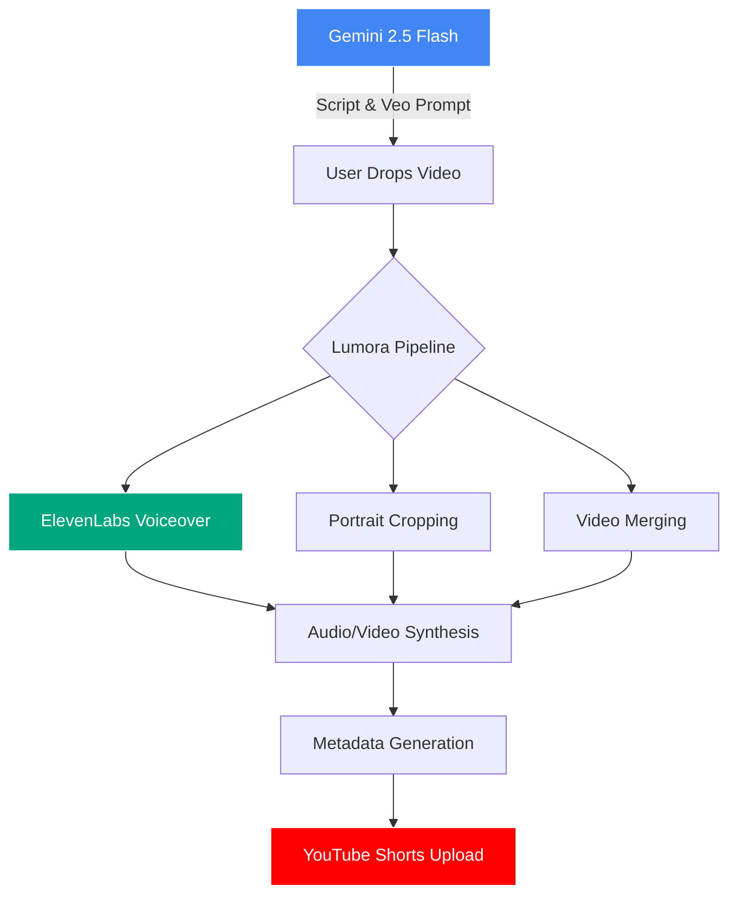

# 🌌 Lumora: The AI Content Pipeline

> **Automated Video Excellence** — From raw creative concepts to viral YouTube Shorts, powered by Gemini and ElevenLabs.

Lumora is a modular, agentic pipeline designed to automate the heavy lifting of short-form video creation. It bridges the gap between AI-generated scripts and production-ready social media content by orchestrating scriptwriting, voiceover generation, intelligent video editing, and automated deployment.

---

## ✨ Features

- **🧠 Agentic Scriptwriting**: Leverages **Gemini 2.5 Flash** to generate "dopamine-optimized" scripts and detailed visual prompts for **Google Veo 3.1**.
- **🎙️ Dramatic Voiceovers**: High-fidelity narration using **ElevenLabs** (featuring the "Brian" professional deep voice).
- **✂️ Intelligent Video Editing**:
  - Automatically crops 16:9 footage to **9:16 Portrait**.
  - Multi-clip merging with user-defined ordering.
  - Precise audio-video synchronization and overlay.
- **📈 Viral Metadata**: Generates SEO-optimized titles, descriptions, and tags based on trending niche data.
- **🚀 One-Click Upload**: Integrated **YouTube Data API** for direct-to-Shorts deployment.

---

## 🏗️ Architecture



---

## 🚀 Quick Start

### 1. Prerequisites
- Python 3.10+
- FFmpeg installed on your system path.
- API Keys for:
  - Google Gemini (AI Studio)
  - ElevenLabs
  - YouTube Data API (OAuth 2.0 Credentials)

### 2. Installation
```bash
git clone https://github.com/whoisadheep/Lumora.git
cd Lumora
python -m venv venv
source venv/bin/activate  # Or `venv\Scripts\activate` on Windows
pip install -r requirements.txt
```

### 3. Configuration
Create a `.env` file in the root directory:
```env
GEMINI_API_KEY=your_key
ELEVENLABS_API_KEY=your_key
```
Place your YouTube `client_secrets.json` in the `config/` directory.

### 4. Running the Pipeline
Simply run the main orchestrator and follow the interactive prompts:
```bash
python main.py
```

---

## 🛠 Tech Stack

- **Large Language Model**: [Google Gemini 2.5 Flash](https://aistudio.google.com/)
- **Voice Synthesis**: [ElevenLabs](https://elevenlabs.io/)
- **Video Processing**: [MoviePy](https://zulko.github.io/moviepy/)
- **API Orchestration**: [Google API Client](https://github.com/googleapis/google-api-python-client)
- **Trend Analysis**: [PyTrends](https://github.com/general-matrix/pytrends)

---

## 📄 License

This project is licensed under the MIT License — see the [LICENSE](LICENSE) file for details.

---

<p align="center">
  Building the future of automated storytelling. 🚀
</p>
